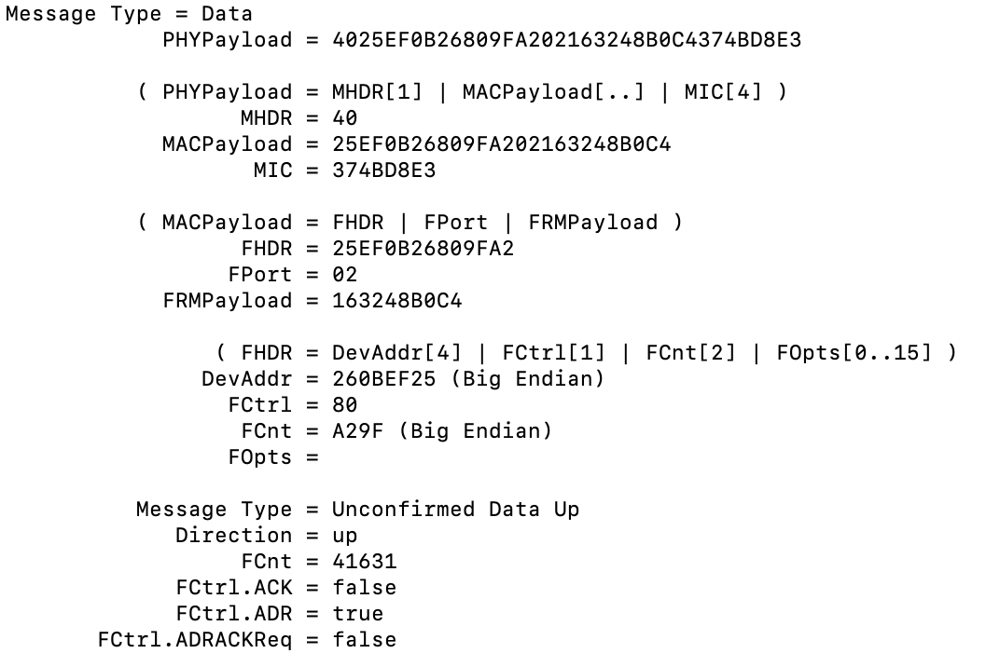

# SECURITÉ LORAWAN
Ce dépôt traite de la sécurité du LORAWAN

## CHIFFREMENT ET AUTHENTIFICATION UTILISANT NODEJS
Ouverture d'une socket serveur (côté serveur) UDP et demande de connexion (côté client). La donnée envoyée est un PHY payload (couche Lora MAC). Le Frame payload est chiffré à l'aide de l'appskey, un mic est calculé pour l'authentification à l'aide de la NwksKey. Le client récupère la trame, vérifie le mic, extrait le Frame payload et le déchiffre.

### DIAGRAMME DE SÉQUENCE :

