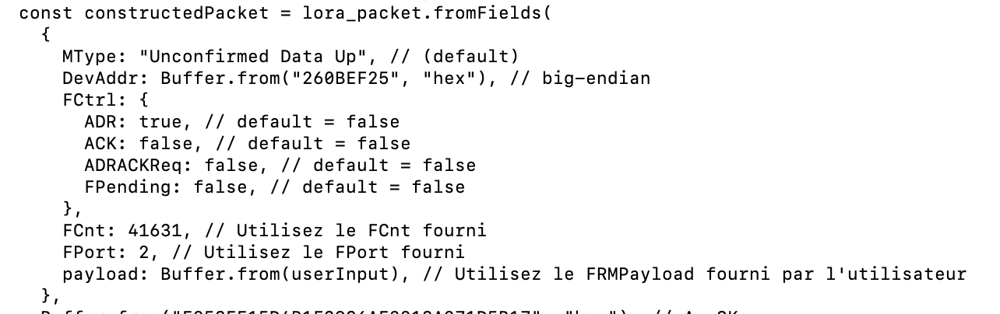
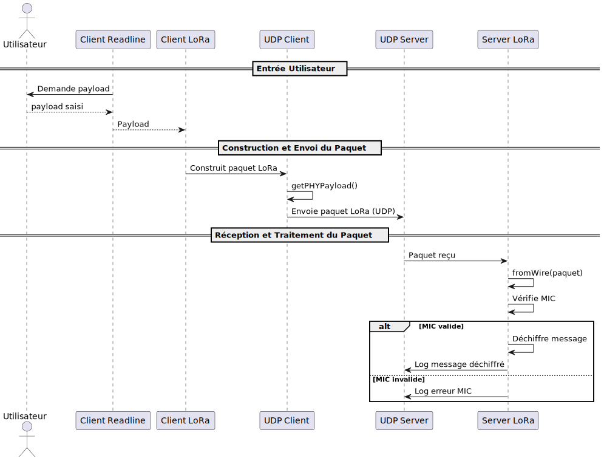

# SECURITÉ LORAWAN
Ce dépôt traite de la sécurité du LORAWAN

## CHIFFREMENT ET AUTHENTIFICATION UTILISANT NODEJS
Ouverture d'une socket serveur (côté serveur) UDP et demande de connexion (côté client). La donnée envoyée est un PHY payload (couche Lora MAC). Le Frame payload est chiffré à l'aide de l'appskey, un mic est calculé pour l'authentification à l'aide de la NwksKey. Le client récupère la trame, vérifie le mic, extrait le Frame payload et le déchiffre.
Le code javascript utilise la librairie lora-packet.

### TOPOLOGIE :

### EXEMPLE DE PHY PAYLOAD GÉNÉRÉ :

- MType: Spécifie le type de message LoRaWAN. Ici, "Unconfirmed Data Up" indique qu'il s'agit d'un message montant (du dispositif vers le serveur) ne nécessitant pas d'accusé de réception (ACK) par le réseau.
- DevAddr: L'adresse du dispositif sur le réseau, représentée ici en hexadécimal. L'adresse est un identifiant unique attribué à un dispositif LoRaWAN au sein d'un réseau spécifique.
- FCtrl: Le champ de contrôle de trame, contenant plusieurs indicateurs :
  - ADR (Adaptive Data Rate): Quand il est à true, cela signifie que l'optimisation du débit de données est activée, permettant au réseau d'ajuster le taux de transmission pour optimiser la consommation d'énergie et la capacité du réseau.
  - ACK: Indique si ce message est un accusé de réception pour un message précédent. Ici, il est défini sur false.
  - ADRACKReq: Si activé, cela indique une demande de vérification de la capacité du réseau à ajuster le débit de données. Ici, il est à false.
  - FPending: Indique s'il y a d'autres trames en attente d'envoi. Ici, il est à false.

- FCnt: Le compteur de trame, qui est un numéro séquentiel attribué aux messages pour assurer l'ordre et l'unicité des messages.
- FPort: Le port de la trame, indiquant à quel port d'application la charge utile du message est destinée.
- payload: La charge utile du message, ici fournie par l'utilisateur et convertie en Buffer depuis une entrée (userInput) codée en chaîne de caractères ou en hexadécimal.

### FORMATAGE DU PAYLOAD GÉNÉRÉ :

### DIAGRAMME DE SÉQUENCE :

